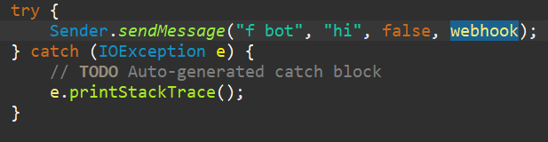
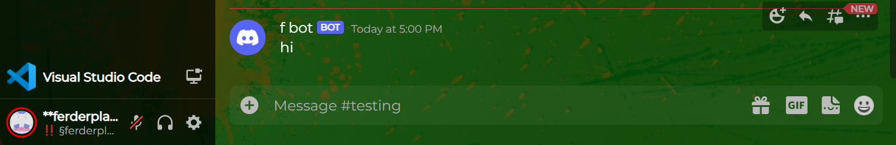

# DiscordWebhookConnector
Discord Webhook intializer + connector, it initializes webhooks, and can send things to them. THIS IS NOT FOR EDUCATIONAL PURPOSES, AS IT ISNT A BACKDOOR, BUT A TOOL

## example:
this code:

returns this:

## also:

dont ask me about my BetterDiscord theme,
i use it, cause its the only working one